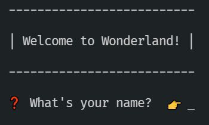

# Alice's Adventures in TypeScriptLand

## Introduction

This lab is based on Alice's Adventures in Wonderland.

If you're not [familiar with the story](https://www.youtube.com/watch?v=FFX8I4yyyxk), things are going to seem extremely strange!

## Goal

The goal of the lab is to make it through Wonderland by fixing the code in each chapter in a way which allows you through to the next chapter.

❗ NOTE: _Each code change is very small and simple_.

This lab isn't about writing tonnes of code. And it's not about writing difficult code. It's about _understanding_ the code enough to make the changes required to get through to the next chapter.

In the process, you'll build up familiarity with TypeScript. And hopefully have some fun too ☺

## Creating your application

This app is a mini-adventure story which runs in the console.

👉 First, fork and clone this repository.

👉 Then run this command:

```
npm install
```

👉 You can then run

```
npm start
```

❗ NOTE: If you look in `package.json` you'll see that `npm start` is actually just an alias for `nodemon index.ts`. Using the [nodemon tool](https://www.npmjs.com/package/nodemon) means you don't have to stop and start the application every time you change the code. Nodemon will automatically spot when files have changed and restart your application.

If you ever need to actually stop your application you can press the key combination `Ctrl + C` to interrupt and kill the application.

You should see a welcome message and a prompt to enter your name.

## Beginning your adventure



Sadly, it seems that no matter what name you enter, you won't be allowed into Wonderland.

Let's take a look at the code in `index.ts` to understand why.

👉 Read `index.ts` and look at the functions called in `console.ts`. Ignore the FIXME comments for now!

These files are pretty simple - mostly basic JavaScript, but note the use of TypeScript to provide typing on the various function parameters.

You'll have noticed the `// 👉 FIXME ❌` comments in `index.ts`.

Just as Alice had her DRINKME potions 🧉, you have some FIXME indicators - these are the places in each chapter that you'll have to change in order to solve the little puzzles.

The first looks pretty clear. We're calling `failImmediately` as our callback function, which doesn't sound great. Looking at the other functions, perhaps `startAdventure` would be more appropriate?

👉 Replace the call to `failImmediately` with `startAdventure` in the "What's your name?" prompt in `index.ts`

Now entering a name makes some progress... but what's this about an entry code?!

## When is ELEVEN Smaller Than THREE?!

Looking at the remaining two FIXMEs, we have:

```TypeScript

const numberBiggerThanThree: any = '11'; // 👉 FIXME ❌

function checkEntryCode(code: any) { // 👉 FIXME ❌
	return code > '3'; // 👉 FIXME ❌
}
```

We're passing in eleven as our entry code, and checking it's bigger than three... but it's returning false 😭

This is a classic JavaScript problem: accidentally passing in the wrong types. We're comparing two strings, and - in JavaScript - this just compares the first two characters, so we're really doing the comparison `1 > 3` which is `false`.

The culprits here are those naughty `any` type annotations. Let's use TypeScript to be specific about what types we want:

👉 In your code, change the `any` type annotations in the above snippet to `number`.

The code will no longer compile because we're trying to set strings to our number variables. Better fix that too:

👉 In your code, remove the string quotes around `11` and `3`.

Now everything works as expected! Defining the correct types helped us catch a bug! 🥳

💡 In a real project, a bug like this could easily show up when users input numeric data into a textbox. By default, the textbox would contain a `string`. If we then try to compare it to a number, TypeScript will help us where JavaScript wouldn't.

Time to enter Wonderland for real. Let's go down the rabbit hole in [activity 1](./docs/activity_1.md).
