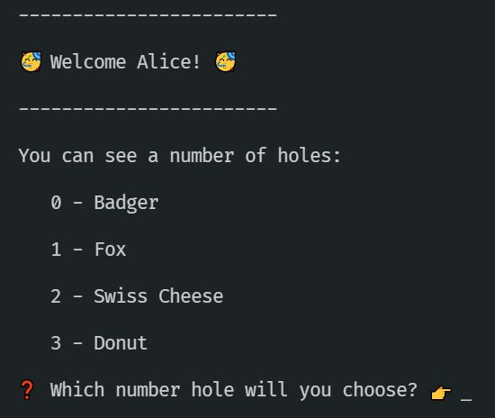

# Activity 1 - Enter the Rabbit Hole

## Incompatible Types

Following the White Rabbit down the rabbit hole sounds easy enough, right?



But no matter which hole you choose, you can't progress.

👉 Read the code in both files in the `chapter_1` subfolder.

There are TWO spots marked with a FIXME. Let's begin with the one in `chapter_1_rabbit_hole.ts`, which reads:

```TypeScript
// @ts-ignore 👉 FIXME ❌
```

That `@ts-ignore` sounds a little suspicious. In fact, this is a comment which switches off some TypeScript type protection! That's a huge red flag ⛳⛳⛳⛳😱 - something we should never consider doing.

👉 Delete the entire line which contains "ts-ignore".

Now your app fails to compile! 😩 That sounds horrible but it's actually GOOD news - TypeScript has found a problem for us.

👉 Hover the red squiggly line where the `ts-ignore` used to be. The error message says something like:

"...the types do not overlap"

🤔 Hmm. We need our `hole` variable value to match the string 'Rabbit' but that's currently impossible. There's no overlap between the string "Rabbit" and the possible values of `hole`.

♠️ Let's dig further.

## Follow the trail of types...

👉 Hover the `hole` variable in `enterHole` and notice that TypeScript is telling us that it can only be one of "Badger", "Donut", "Swiss Cheese" or "Fox". So comparing `hole` to "Rabbit" causes an error as we know that the condition is always `false`. TypeScript reckons that making a comparison that's ALWAYS `false` is probably a mistake that we didn't intend!

🔍 Let's investigate the setup a little more to make sure we understand everything.

🔍 The `hole` variable is annotated as a type `Hole`, which is defined elsewhere. You can hover the `Hole` type to confirm that it is defined as `type Hole = "Badger" | "Fox" | "Swiss Cheese" | "Donut"` - indeed, it is definitely only one of those strings.

👉 Before we investigate where the `Hole` type comes from, let's go on a diversion and understand how our user input gets converted from a `string` to a `Hole`.

0️⃣ The user inputs a `string` when asked to choose a hole.
1️⃣ This input is passed to `chooseHole` as a `string`. Makes sense!
2️⃣ `chooseHole` calls `parseHoleInput`. Go find that file in `ui/parse_input.ts`!
3️⃣ `parseHoleInput` uses some logic to convert that `string` to either a `Hole` or `undefined`
4️⃣ Back in `chooseHole` if `undefined` is returned then an error is printed.
5️⃣ Otherwise we know for sure we have a valid `Hole`, so we can call `enterHole` with a valid choice.

👉 Make sure you understand the above process!

💡 This technique keeps the `string` data isolated to just `parseHoleInput` - so only ONE function needs to worry about things like "what happens if the user enters 'ahauigehrai' instead of a valid number?"

---

## Handling all cases

👉 Hover the `hole` variable at different points in `chooseHole` to see how the type loses its ability to be `undefined`, so we can be sure it is defined when we call `enterHole`!

🥳 This means that our "logic" functions like `chooseHole` can be kept very simple. They don't need to concern themselves with missing input. We enforce that they MUST have a valid `Hole` to work from by making the input parameter a `Hole` and then using the above process to ensure that this is true. TypeScript helps us to enforce that separation, once we declare that `enterHole` requires a `Hole`.

---

This is all very interesting, but it isn't helping us to enter the `Rabbit` hole, which is what we really need to do!

👉 Look at the FIXME in `chapter_1_types.ts`, where the custom `Hole` type is defined.

I'm sure you've figured it out already - we're not even defining a rabbit hole! TypeScript won't even let us compile the app since we've told it the hole NEEDS to be a Rabbit. It's catching the problem before our app has even run 💃🕺

👉 Add 'Rabbit' to the array of possible holes.

💡 This means the `Hole` type now includes "Rabbit". It's possible for users to choose Rabbit and continue to the next screen!

🥳 Now you can choose 'Rabbit' and progress deeper into Wonderland 🥳

Let's see what's happening with the Cheshire Cat in [activity 2](./activity_2.md).
