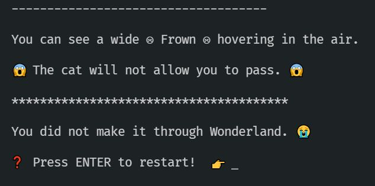

# Activity 2 - The Cheshire Cat

## Const Assertions

The Cheshire Cat is famous for disappearing but leaving only a wide grin visible in the air.



Unfortunately, it seems that he's currently displaying the wrong facial expression and he won't let you continue.

👉 Check out `2_cheshire_cat.ts` and note the FIXME: you have to add some code without altering anything else.

Again, the puzzle is very simple. The expression is defined to be one of a small number of possibilities.

👉 Try setting the cat's expression to something random: `theCat.expression = "Jealous";` for example.

Notice how TypeScript gives you some helpers via autocomplete, and it won't let you set it to just anything?

👉 Replace the FIXME and set the cat's expression to a grin as required to move on:

```JavaScript
theCat.expression = '😁 Grin 😁';
```

That was easy!

## What's a Const Assertion?!

💡 The interesting thing here is the `as const` at the end of our expression array:

```TypeScript
const expressions = [
	'☹ Frown ☹',
	'🙂 Smile 🙂',
	'😁 Grin 😁',
	'😶 Blank Face 😶',
	'😡 Angry Face 😡',
] as const;
```

The first `const` in this statement is saying "I do not intend to reassign this variable" but the `as const` is saying "The CONTENTS of this array will never change".

This is a purely TypeScript feature. It allows TypeScript to be SURE that this array will only ever contain one of those 5 specific strings. Without the `as const` all TypeScript knows is that this is an `Array<string>` - i.e. an array that contains strings, but those strings could be anything.

💡 Restricting the contents of the array gives us more power, as we can now use this array to define a type:

```TypeScript
type FacialExpression = typeof expressions[number];
```

This creates a type `FacialExpression` which is defined to be "anything that appears in the `expressions` array". Now we have the convenience that we can mark anything in our application as a `FacialExpression` and we know for sure it will be one of those five specific strings.

You can see how this could be useful in all kinds of situations. For example:

```TypeScript
const responseStatus = [
	'Idle',
	'Pending',
	'Awaiting',
	'Returned',
	'Error',
] as const;
type ResponseStatus = typeof responseStatus[number];

// Notice we can define the 'type' of the someStatus 
// variable to be that of ResponseStatus
const someStatus : ResponseStatus = getStatus();

// We could even switch through on that variable
// and TypeScript will ensure we check only on the specific 
// statuses we have defined
switch(someStatus){
	case 'Idle':
	 // etc
}
```

Now let's go meet the Mad Hatter in [activity 3](./activity_3.md).
