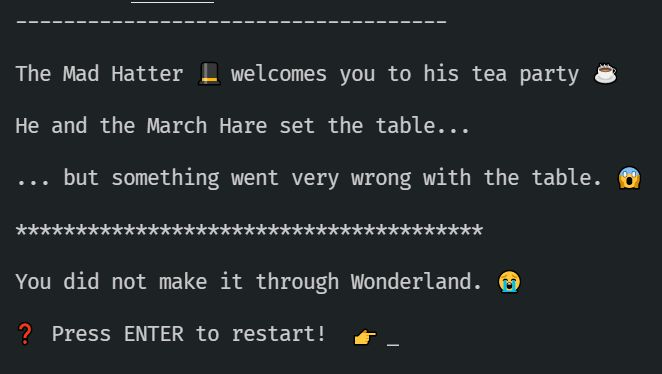

# Activity 3 - The Mad Hatter's Tea Party

## Types Made from Other Types



The Mad Hatter 🎩 has invited you to his tea party, but it seems something is wrong with the table.

👉 Read `3_tea_party.ts` and note the FIXME in `setTheTable()`

💡 Notice that the function is returning a `Table` which is supposed to have an `Array<Seat>`.

💡 The `Seat` has a `Drink` which itself has a `DrinkType`. User-defined types can refer to one another in order to build up more complex types. This is powerful - whenever we use a `Seat` in the application we can be sure it has all the info required for each `Seat`.

👉 Let's try adding a seat to the array. Replace the return in `setTheTable()` with this:

```JavaScript
return {
	seats: [
		{
			drink: {
				type: 'Lemonade',
				poured: false,
			},
		},
	],
};
```

That's progress - the party is happening, but there's not enough seats. Try writing a loop to set more seats:

👉 Replace the return in `setTheTable()` with this:

```JavaScript
const table: Table = { seats: [] };

	for (let i = 0; i < 4; i++) {
		table.seats.push({
			drink: {
				type: 'Lemonade',
				poured: false,
			},
		});
	}
	return table;
```

Now there's enough seats, but you need to pour the tea!

👉 Replace `Lemonade` with `Tea` and set `poured` to `true`.

Success! You've made it through the Tea Party ☕

Let's play some croquet in [activity 4](./activity_4.md).
