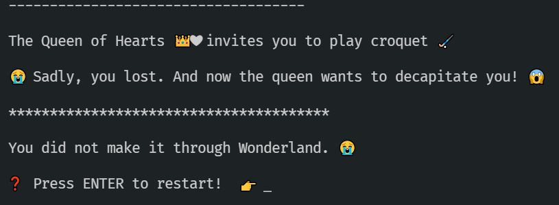

# Activity 4 - The Queen's Croquet

## Dabbling with Generics

In Wonderland, croquet is played by using a flamingo to push a hedgehog through an arch made of playing cards.

🏑 🦩 🦔 ♥♦♠♣

Of course!



👉 Read `4_croquet.ts`

Generics are a powerful TypeScript feature which we will explore more in future. For now, we just want to get a little familiarity with the syntax.

All we need to know is that generics are "types that can change in different circumstances".

A good example of a generic is the `Array` type. It is often written as `Array<T>` which means "an array of any type". (When defining generics, the type parameters are usually called `T`.)

`Array<T>` is how we refer to the array type _in general_ because _in general_ arrays can have anything in them, so we don't know what `T` might refer to. (Think of it like `x` in a mathematical equation - it stands for "any number".)

But a particular array always has a specific type. For example, we might define an `Array<number>`, meaning "this specific array must have only numbers in it".

💡 For arrays, there is no difference between writing `Array<number>` and `number[]`.

So the array type changes depending on what the particular array contains. In general, arrays can have anything in. But a specific array must have a particular type in it.

💡
`Array<T>` - how we talk about the general concept of an array
`Array<string>` - the type of a particular array that has strings in it
`Array<string | number>` - the type of a particular array that can have strings and numbers in it

## Generic Croquet

Notice the generic `Croquet<TBall,TMallet>` interface (around line 24) which operates on two generic types, one for the ball and one for the mallet. This has TWO type parameters - a type for a ball, and a type for a mallet.

The `hit` function defined on the interface uses those types so it knows what is hitting what.

However, the Queen of Hearts hasn't set any limits on those generic types, which means we can use ANYTHING as a mallet or ball. In our particular instance of the `Croquet` interface (around line 33), we are currently using `number`, which doesn't seem right...

💡 Before we start, also notice that within the `hit` function we are checking for `string` types. Our custom `Ball` and `Mallet` types _don't actually exist at runtime_ - only when we're writing the code.

⚠️ If you are used to languages like C# and Java this can be a bit surprising, as you might expect to be able to use `typeof Ball` in TypeScript - but `Ball` doesn't exist when the code comes to run, as TypeScript transpiles down to JavaScript.

Bearing that in mind, let's pass the Queen's Croquet challenge!

# FIXME

Currently, the `Croquet<TBall,TMallet>` interface is taking `<number, number>` rather than using our custom types for ball and mallet.

👉 At the first FIXME, we want to restrict the generic type in our interface. This is done using the `extends` keyword.

Change:

```TypeScript
interface Croquet<TBall, TMallet> {
	hit: (ball: TBall, mallet: TMallet) => boolean;
}
```

to:

```TypeScript
interface Croquet<TBall extends Ball, TMallet extends Mallet> {
	hit: (ball: TBall, mallet: TMallet) => boolean;
}
```

💡 `extends` adds a restriction to a generic type, saying that the type must inherit in some way from our specified type.

This is great! We want our ball to be a `Ball` and mallet to be a `Mallet`.

👉 Notice that this immediately breaks the FIXME below - the numbers we were passing in are no longer valid as they don't inherit from either `Ball` or `Mallet`.

👉 Change `<number, number>` to use the provided custom types `<Ball, Mallet>`

👉 The final FIXME: Thanks to our generic type restrictions, TypeScript now knows that the number parameters we were passing in before are not valid balls or mallets.

👉 Try passing in different strings and notice that TypeScript will only allow you to pass in a valid ball or mallet.

👉 If we use the correct ball and mallet then we'll succeed at the particular game we're playing:

```JavaScript
game.hit("Hedgehog", "Flamingo")
```

🥳 These changes are enough to pass by the croquet challenge.

# Lessons to take from this chapter:

💡 Our custom `Ball` and `Mallet` types use the `|` operator to combine types. `|` means 'or', so the ball can be a "Hedgehog" or a "Cricket ball", etc.

💡 We can use generics to make functions that can be called only with certain types. The type of the parameter in `hit` changes when you alter the interface.

💡 Familiarity with generic syntax.

💡 The custom types `Ball` and `Mallet` are really strings when the code is running.

Unfortunately, following our croquet victory, it's time to stand trial for theft in [activity 5](./activity_5.md).
