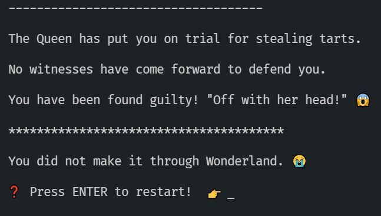

# Activity 5 - "Off with her head!"

## Playing with Functions and Type Inference

You've been falsely accused of stealing the Queen's tarts.



👉 Read `5_queen_of_hearts.ts`

👉 The first FIXME is:

```TypeScript
let witnesses = [];
```

This probably ought to call the `getWitnesses` function below.

```TypeScript
let witnesses = getWitnesses();
```

But what should that function look like?

👉 Currently the function signature is a bit useless:

```TypeScript
function getWitnesses(): any {
	return [];
}
```

`any` is always a bit suspicious in a TypeScript program. Writing `any` basically removes all of the usefulness of TypeScript.

🤔 What should this function return?

👉 Change the `any` return value to something useful...maybe an Array of Witnesses could work?

...

...

...

```TypeScript
function getWitnesses(): Array<Witness> {
	return [];
}
```

❗ You could also use `Witness[]` - they're the same thing!

👉 Update the `getWitnesses` function to return enough witnesses. Include `The March Hare`, `The Mad Hatter`, `The White Rabbit` and `The Cheshire Cat`.

👉 Notice the `giveEvidence` function that each witness requires. The signature is `() => Verdict`, i.e. the function takes no parameters and returns a verdict.

👉 Try making some of the witnesses give a Guilty verdict (or a random verdict) and see what happens.

👉 Next, make sure each verdict is Not Guilty.

This should be enough to pass the trial! If you're struggling, here's a potential solution for `getWitnesses`:

```JavaScript
return [
		{
			name: 'The Mad Hatter',
			giveEvidence: () => 'Not Guilty', // implicit return
		},
		{
			name: 'The March Hare',
			giveEvidence: () => { return 'Not Guilty' }, // explicit return (same result as above!)
		},
		{
			name: 'The Cheshire Cat',
			giveEvidence: () => 'Not Guilty',
		},
		{
			name: 'The White Rabbit',
			giveEvidence: () => 'Guilty',
		},
	];
```

# But Wait!

👉 **_Try this now!_** Remove the return type annotation from `getWitnesses`, so the function definition looks like this:

```JavaScript
function getWitnesses() /* ❌ :Array<Witness> REMOVE THIS ANNOTATION */ {
	// leave your function intact here
}
```

🤔 That's weird! Now your `witnesses` variable complains that it isn't getting a valid `Array<Witness>` even though the code hasn't changed at all.

👉 If you look closely at the error message, it is complaining that the types don't match. That's because TypeScript knows that a Verdict can't just be _any_ string, it has to be either `Guilty` or `Not Guilty`. Right now our `getWitnesses` function always returns either `Guilty` or `Not Guilty`... but that isn't being enforced by the function!

👉 Prove this to yourself by altering the `getWitnesses` function to return some nonsense:

```TypeScript
function getWitnesses() {
	return [
		{
			name: 'The Mad Hatter',
			giveEvidence: () => 'Bananananananana', // not valid
		},
		{
			name: 'The March Hare',
			giveEvidence: () => {
				return 'Cheese'; // not valid
			},
		},
		{
			name: 'The Cheshire Cat',
			giveEvidence: () => 'Biscuits', // not valid
		},
		{
			name: 'The White Rabbit',
			giveEvidence: () => '🏗️🦩', // not valid
		},
	];
}
```

👉 Aha! Your function doesn't complain at all! You've defined the function with no particular return type, so TypeScript is happy for you to return any verdict at all - you haven't told it that these `giveEvidence` functions are meant to return specifically a `Verdict` as opposed to any old string.

That means that when you try to put the result into `witnesses` it complains, because you've told it that `witnesses` are `Array<Witness>` so each of the `giveEvidence` functions there really should return a proper `Verdict`. It can see that `name` matches, but `giveEvidence` from your function below returns strings rather than `Verdict`.

👉 Now add the return type annotation back:

```TypeScript
function getWitnesses() : Array<Witness> {
	// leave the definition intact with the invalid verdicts
}
```

👉 Now all of the verdicts are enforced to be valid by TypeScript. Change them back to valid `Verdict`s.

# One Final Rewrite

👉 Let's parameterise `getWitnesses` so it takes a list of names and returns them as valid Witnesses after:

```TypeScript
function getWitnesses(witnessNames: string[]) : Witness[] {
	// rewrite the function to use the list of names as the names for the witnesses
}
```

...

Try it yourself, then scroll down for a solution...

...

👉 Solution:

```TypeScript
function getWitnesses(witnessNames: string[]) : Witness[] {
	return witnessNames.map(n => { return { name: n, giveEvidence: () => 'Not Guilty',}});
}
```

# Lessons to take from this chapter:

💡 Familiarity with function return annotation, parameter annotation and type inference.

💡 Sometimes we want to be explicit about function returns so TypeScript will force us to make sure each output is valid.

💡 Often it's better to allow TypeScript to _infer_ what is returned, i.e. don't bother with a return type annotation:

```TypeScript
function someFunction(someParams : Array<Stuff>){
	// calculate things from params here
	return someResult;
}
```

TypeScript will infer the type of `someResult` for you.

💡 _A good rule of thumb: Be strict about function inputs, and let TypeScript infer the types of outputs_! i.e. Always put type annotations on function inputs, but only add return type annotations when you need them (like we did in the example above).

👉 Time to leave Wonderland in [activity 6](./activity_6.md).
