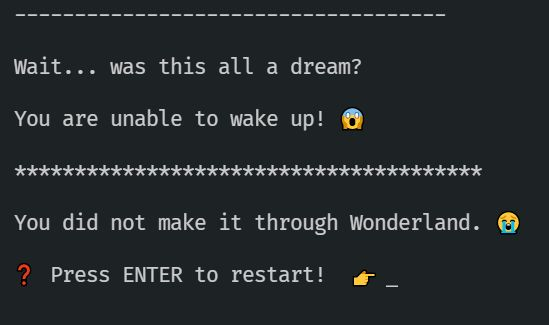

# Activity 6 & Extensions - Time to Wake Up

## Optional Properties



👉 Read `6_wake_up.ts`

It looks like our `tryToWakeUp()` function isn't returning whatever we need it to.

The condition to meet is this:

```TypeScript
awoken.wake?.wake?.wake?.canWake === 'Yes'
```

That's a LOT of optional properties, but scrolling up we can see the `interface` definitions that are causing this. Each type has an optional property called `wake`. The `?.` operator accesses it if it's available, if not then the condition will resolve to `false`.

So we just need to adjust the `tryToWakeUp()` output so it meets the criteria.

👉 Change the return value of `tryToWakeUp` so accessing `.wake?.wake?.wake?.canWake` will result in the string "Yes".

❗ NB because we've defined this in our interfaces, TypeScript will help you! Start by adding a "wake" property inside the return object:

```TypeScript

return {
	wake: {

	};
```

In VSCode, Autocomplete ought to help you out. Adding a wake property inside that should also trigger autocomplete:

```TypeScript
return {
	wake:
	{
		wake:
		{
	  	}
    };

```

And so on... eventually you will reach the final interface which has a `string` property called `canWake`:

```JavaScript

return {
	wake: {
		wake: {
			wake: {
				canWake: 'Yes',
				},
			},
		},
	};
```

This object meets the condition and you will be able to wake up!

This is a confusingly-designed interface structure - in the real world our interfaces should be less repetitive than those required to escape from a magical Wonderland dreamworld. But even with this horrible interface structure the tools are working in our favour as they help us to autocomplete our way to the right object shape to meet the condition.

## Congratulations

You've had a chance to play with TypeScript features and syntax. In the process you've seen some poor choices - confusing interface structures, bad choices of generic functions. And you've seen some ways that TypeScript makes it easy to work even with these bad choices!

BUT there's more...

# Extension 1 - Add to Alice's Adventure

Can you add another screen (or more!) to Alice's adventures? Perhaps she could go for a walk or head to work or buy some groceries...

Of course, the story doesn't matter at all, but why not pick some TypeScript features to play with and see if you can extend her adventure further?

👉 Extend Alice's adventure with more screens. This is a chance to have fun and be creative while getting more familiar with TypeScript 🎨

# Extension 2 - Convert an existing program

Can you take some JavaScript you've written already and convert it to TypeScript? Some of the exercises from earlier in the programme could be good candidates.

Think about how would you make _good_ use of TypeScript. Even something as simple as adding parameter type checking can make JavaScript programs much easier to work with!

👉 Pick an existing program, function or class you've written and create a TypeScript version.

TIPS:

-   You may have to `npm install typescript` and figure out how to get it working in your particular project.
-   Remember TypeScript needs to be compiled into JavaScript by _tsc_.
-   We can use "nodemon" along with "ts-node" to automatically compile & run TypeScript code.
-   Have a look at the `package.json` in this Alice project for ideas of dependencies and how `npm start` can be set up to work with TypeScript code.
-   Or you may want to set up a fresh TypeScript project from scratch. Commands like `npm init` and `git init` will be useful.

As ever, reach out on Slack if you need any help figuring things out. Have fun 😊
